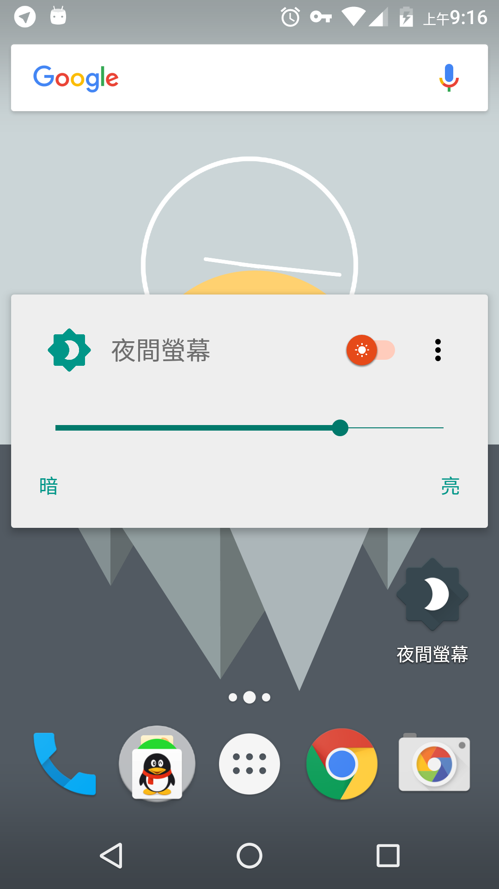
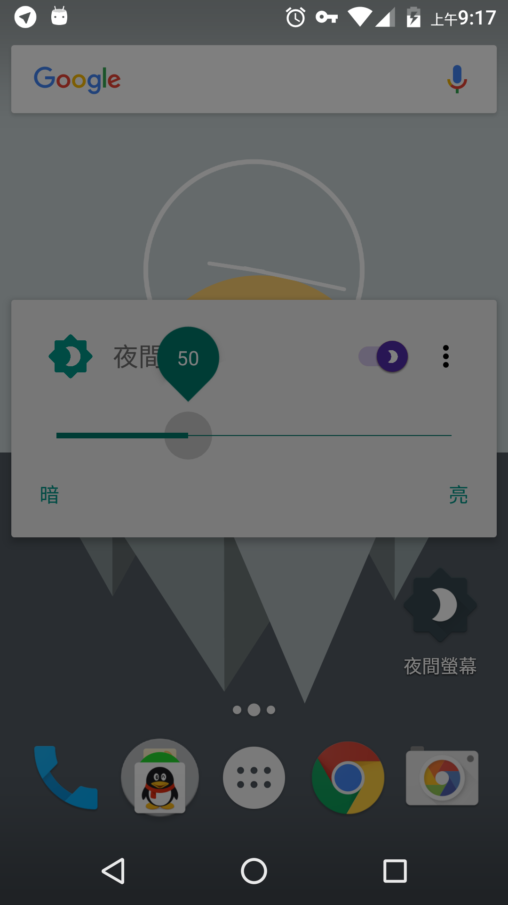
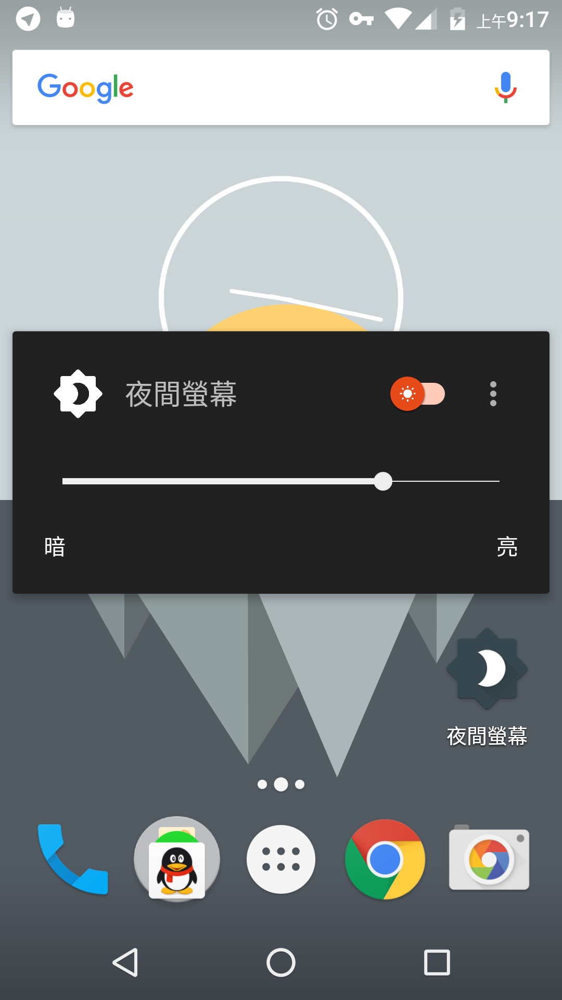

# Night Screen 夜间屏幕


a Material Design Android app which can prevent your eye from being hurt by screen light.

一个能减少屏幕光线对眼睛造成伤害的 Material Design 风格 Android 应用程序

<a href="https://f-droid.org/packages/info.papdt.blackblub/" target="_blank">
</a>
<a href="https://play.google.com/store/apps/details?id=info.papdt.blackblub" target="_blank">
</a>

---

### 支持系统

Android 5.0+

### 项目说明

嗯……暂时还想不到有什么好说的。

### 效果截图

<a href="./art/1.png"></a><a href="./art/2.png"></a><a href="./art/3.png"></a>

---

### Open Source License

```
GNU GENERAL PUBLIC LICENSE Version 3, 29 June 2007

Copyright (C) 2016 Paper Airplane Dev Team

This program comes with ABSOLUTELY NO WARRANTY.
This is free software, and you are welcome to redistribute it under certain conditions.
```
